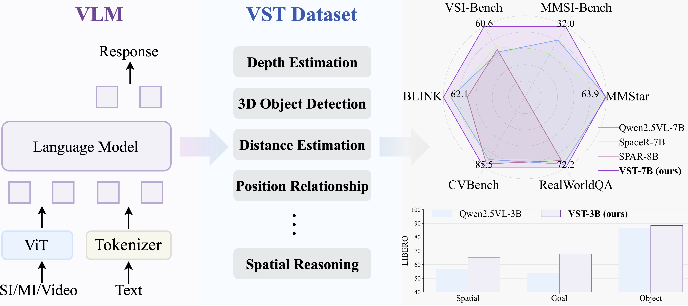

<div align='center'>
<h1>Visual Spatial Tuning</h1>


[](https://arxiv.org/abs/2511.05491)
[](https://yangr116.github.io/vst_project/)
[](https://huggingface.co/collections/rayruiyang/vst)
</div>

We introduce **Visual Spatial Tuning (VST)**, a comprehensive framework designed to cultivate Vision-Language Models (VLMs) with human-like visuospatial abilities—from spatial perception to advanced reasoning.



---

## 🔥 News
* Training code has been updated and verified, please see [Train](###train), which is very efficient because of data packing.


## 💡 Key Highlights

✨ **VST-P**: 4.1M samples across 19 skills, spanning single images, multi-image scenarios, and videos—boosting spatial perception in VLMs.  
✨ **VST-R**: 135K curated samples that teach models to reason in space, including step-by-step reasoning and rule-based data for reinforcement learning.  
✨ **Progressive Training Pipeline**: Start with supervised fine-tuning to build foundational spatial perception, then reinforce spatial reasoning abilities via RL. VST achieves state-of-the-art results on spatial benchmarks (34.8% on MMSI-Bench, 61.2% on VSIBench) without compromising general capabilities.  
✨ **Vision-Language-Action Models Enhanced**: The VST paradigm significantly strengthens robotic learning.

---

## 📊 Dataset Overview


### 🖼️ VST-Perception (VST-P)
- **4.1M samples** across **19 tasks** for supervised fine-tuning.
- Covers three primary vision scenarios: *single-image*, *multi-image*, and *video*.
- VLMs tuned on VST-P show strong improvements in spatial perception:
  - ~20% boost on CVBench-3D
  - ~5% increase on BLINK
  - ~16% gain on VSIBench

### 🧠 VST-Reasoning (VST-R)
- **135K samples**, split into:
  - **Reasoning steps (CoT)**: Teach models how to reason spatially.
  - **Rule-checkable data**: Used in online RL to further enhance reasoning skills.
- VLMs tuned on VST-R demonstrate:
  - 8.9% improvement on MMSI-Bench

---

## 🏷️ Model Card

| Model Name     | 🤗 HuggingFace |
|:-------------- |:----------------------:|
| VST-3B-SFT     | [rayruiyang/VST-3B-SFT](https://huggingface.co/rayruiyang/VST-3B-SFT)           |
| VST-3B-RL      | [rayruiyang/VST-3B-RL](https://huggingface.co/rayruiyang/VST-3B-RL)           |
| VST-7B-SFT     | [rayruiyang/VST-7B-SFT](https://huggingface.co/rayruiyang/VST-7B-SFT)           |
| VST-7B-RL      | [rayruiyang/VST-7B-RL](https://huggingface.co/rayruiyang/VST-7B-RL)           |

<details>
  <summary>Click to see performance 📈 </summary>
  
  <h3>📈 Spatial & General Benchmarks</h3>
  <table>
    <tr>
      <th>Models</th><th>CV</th><th>3DSR</th><th>MMSI</th><th>BLINK</th><th>VSI</th><th>MMStar</th><th>MMB</th><th>RealworldQA</th><th>MMMU</th><th>OCRB</th><th>AI2D</th>
    </tr>
    <tr>
      <td>VST-3B-SFT</td><td>84.4</td><td>54.1</td><td>30.2</td><td>59.1</td><td>57.9</td><td>58.0</td><td>80.9</td><td>68.4</td><td>45.2</td><td>83.7</td><td>82.5</td>
    </tr>
    <tr>
      <td>VST-3B-RL</td><td>84.2</td><td>56.5</td><td>31.3</td><td>57.2</td><td>57.7</td><td>58.9</td><td>80.5</td><td>68.5</td><td>49.8</td><td>80.9</td><td>82.4</td>
    </tr>
    <tr>
      <td>VST-7B-SFT</td><td>85.5</td><td>54.6</td><td>32.0</td><td>62.1</td><td>60.6</td><td>63.1</td><td>83.3</td><td>72.2</td><td>50.6</td><td>85.5</td><td>84.9</td>
    </tr>
    <tr>
      <td>VST-7B-RL</td><td>86.5</td><td>60.1</td><td>34.8</td><td>62.6</td><td>61.2</td><td>63.5</td><td>83.0</td><td>68.5</td><td>49.4</td><td>86.1</td><td>83.5</td>
    </tr>
  </table>

  <h3>📈 VSIBench</h3>
  <table>
    <tr>
      <th>Methods</th><th>Avg.</th><th>Obj. Count</th><th>Abs. Dist.</th><th>Obj. Size</th><th>Room Size</th><th>Rel. Dist</th><th>Rel. Dir.</th><th>Route Plan</th><th>Appr. Order</th>
    </tr>
    <tr>
      <td>VST-3B-SFT</td><td>57.9</td><td>69.3</td><td>45.4</td><td>71.8</td><td>62.4</td><td>59.0</td><td>46.0</td><td>38.7</td><td>70.2</td>
    </tr>
    <tr>
      <td>VST-3B-RL</td><td>57.7</td><td>66.6</td><td>45.0</td><td>72.8</td><td>60.9</td><td>59.9</td><td>47.6</td><td>40.7</td><td>68.3</td>
    </tr>
    <tr>
      <td>VST-7B-SFT</td><td>60.6</td><td>72.0</td><td>44.4</td><td>74.3</td><td>68.3</td><td>59.7</td><td>55.8</td><td>44.9</td><td>65.2</td>
    </tr>
    <tr>
      <td>VST-7B-RL</td><td>61.2</td><td>71.6</td><td>43.8</td><td>75.5</td><td>69.2</td><td>60.0</td><td>55.6</td><td>44.3</td><td>69.2</td>
    </tr>
  </table>

  <h3>📈 SUN RGBD 3D Object Detection</h3>
  <table>
    <tr>
      <th>Methods</th><th>AP@15</th>
    </tr>
    <tr>
      <td>Seed1.5-VL</td><td>33.5</td>
    </tr>
    <tr>
      <td>Gemini-2.0-Pro</td><td>32.5</td>
    </tr>
    <tr>
      <td>Gemini Robotics-ER</td><td><b>48.3</b></td>
    </tr>
    <tr>
      <td>VST-3B-SFT</td><td>37.3</td>
    </tr>
    <tr>
      <td>VST-3B-RL</td><td>40.1</td>
    </tr>
    <tr>
      <td>VST-7B-SFT</td><td>41.6</td>
    </tr>
    <tr>
      <td>VST-7B-RL</td><td><b>44.2</b></td>
    </tr>
  </table>
</details>


---


## ⚡ Getting Started
```bash
pip install transformers
# It's highly recommanded to use `[decord]` feature for faster video loading.
pip install qwen-vl-utils
```

### Cookbook

* [scene understanding](cookbook/scene_understanding.ipynb)
* [3d object detection](cookbook/object_detection_3d.ipynb)
* still updating


### Using 🤗  Transformers to Chat

```python
import torch
from transformers import Qwen2_5_VLForConditionalGeneration, AutoTokenizer, AutoProcessor
from qwen_vl_utils import process_vision_info

THINK_SYSTEM_PROMPT = "You are a helpful assistant. You should first think about the reasoning process in the mind and then provide the user with the answer. The reasoning process is enclosed within <think> </think> tags, i.e. <think> reasoning process here </think> answer here."
think_mesg = {
                "role": "system",
                "content": [{"type": "text", "text": THINK_SYSTEM_PROMPT}],
            }

enable_thinking=False

model_path="rayruiyang/VST-7B-RL"

# We recommend enabling flash_attention_2 for better acceleration and memory saving, especially in multi-image and video scenarios.
model = Qwen2_5_VLForConditionalGeneration.from_pretrained(
    model_path,
    torch_dtype=torch.bfloat16,
    attn_implementation="flash_attention_2",
    device_map="auto",
)

# default processer
processor = AutoProcessor.from_pretrained(model_path, min_pixels = 256*28*28, max_pixels=1280*28*28)

messages = [
    {
        "role": "user",
        "content": [
            {
                "type": "image",
                "image": "http://images.cocodataset.org/train2017/000000075668.jpg",
            },
            {"type": "text", "text": "Consider the real-world 3D locations of the objects. Is the 'no motorcycle' sign directly above the red bus?"},
        ],
    }
]

if enable_thinking:
    messages.insert(0, think_mesg)


# Preparation for inference
text = processor.apply_chat_template(
    messages, tokenize=False, add_generation_prompt=True
)
image_inputs, video_inputs = process_vision_info(messages)
inputs = processor(
    text=[text],
    images=image_inputs,
    videos=video_inputs,
    padding=True,
    return_tensors="pt",
)
inputs = inputs.to("cuda")

# Inference: Generation of the output
generated_ids = model.generate(**inputs, max_new_tokens=128)
generated_ids_trimmed = [
    out_ids[len(in_ids) :] for in_ids, out_ids in zip(inputs.input_ids, generated_ids)
]
output_text = processor.batch_decode(
    generated_ids_trimmed, skip_special_tokens=True, clean_up_tokenization_spaces=False
)
print(output_text[0])
```

### Train

```bash
git clone https://github.com/Yangr116/VST
cd VST
# install veomni
git clone -b v0.1.3 https://github.com/ByteDance-Seed/VeOmni.git third_party/VeOmni
cd third_party/VeOmni
pip install -e .
# install requirements
cd ../..
pip install -r requirements.txt
```

NOTE: we use torch2.5.1+cu124, other torch version is also fine.

Please follow [docs/train.md](./docs/train.md) to prepare data and train models.


### Evaluation

Please see [docs/evaluation.md](./docs/evaluation.md)


## 📜 License
This project is licensed under the Apache License. See the [LICENSE](./LICENSE) file for details.

The VST-3B model is fine-tuned from Qwen2.5VL-3B, its license is [Qwen2.5VL-3B LICENSE](https://huggingface.co/Qwen/Qwen2.5-VL-3B-Instruct/blob/main/LICENSE).

## Acknowledgement

Thanks for the projects: [Qwen2.5VL](https://github.com/QwenLM/Qwen3-VL/tree/main), [VeOmni](https://github.com/ByteDance-Seed/VeOmni), [EasyR1](https://github.com/hiyouga/EasyR1), and [VLMEvalKit](https://github.com/open-compass/VLMEvalKit).

If you find VST useful for your research or applications, please ⭐ star the repo or cite our work:

```bibtex
@article{vst,
  title={Visual Spatial Tuning},
  author={Rui Yang, Ziyu Zhu, Yanwei Li, Jingjia Huang, Shen Yan, Siyuan Zhou, Zhe Liu, Xiangtai Li, Shuangye Li, Wenqian Wang, Yi Lin, Hengshuang Zhao},
  journal={arXiv preprint arXiv:2511.05491},
  year={2025}
}
```
